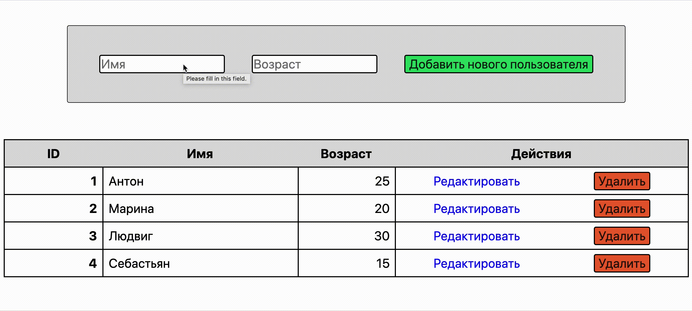

# Тестовое задание "web-сервер на Node.js"



## Задание

Имеется массив пользователей:

```JavaScript
const users = [
    {
        id: 1,
        name: "Антон",
        age: 25
    },
    {
        id: 2,
        name: "Марина",
        age: 20
    },
    {
        id: 3,
        name: "Людвиг",
        age: 30
    },
    {
        id: 4,
        name: "Себастьян",
        age: 15
    }
];
```

Создайте web-сервер, при обращении к которому можно получить всех пользователей и одного пользователя по id.
Создать интерфейс, с помощью которого можно отредактировать, добавить и удалить пользователя.

## Запуск

```bash
npm install
npm start
```

Перейти на url `localhost:3000/users`

### Использованные технологии

* node.js
* mustache
* fetch API
* SSR
* ES6
